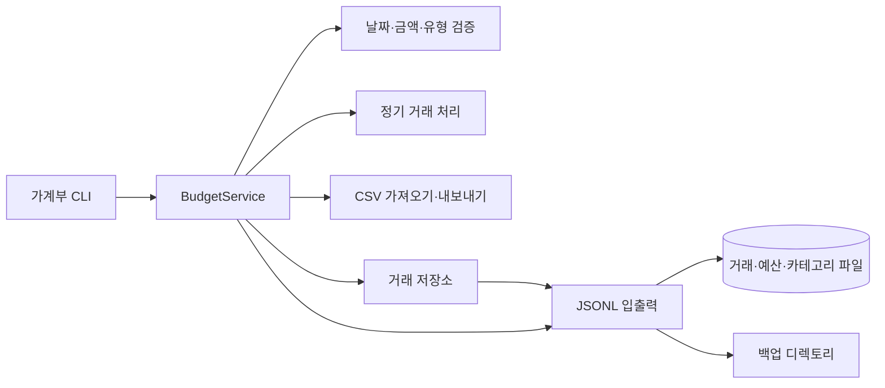

# 개인 가계부 CLI

## 프로젝트 소개

거래, 카테고리, 월별 예산, 반복 거래를 로컬 JSONL 파일로 관리하는 Python 명령줄 도구입니다. 외부 패키지나 서버 없이 실행하며 CSV 가져오기·내보내기와 백업을 지원합니다.

## 핵심 특징

- 거래 추가·목록·검색·수정·삭제
- 카테고리 관리, 월별 예산과 수입·지출 요약
- 반복 거래 등록과 지정 월 적용
- UTF-8 CSV 가져오기·내보내기와 데이터 백업
- 입력 검증, 스트리밍 읽기, 임시 파일을 통한 원자적 교체

## 아키텍처

`CLI → 서비스 → 저장소 → JSONL`로 책임을 나눕니다. 모델은 데이터 형식을, 검증기는 날짜·금액 등의 규칙을 담당합니다.

| 경로 | 역할 |
| --- | --- |
| `src/budget_app/` | 실행 가능한 애플리케이션 패키지 |
| `examples/data/` | 실행을 시작할 수 있는 JSONL 샘플 데이터 |
| `examples/transactions.csv` | 기존 샘플의 거래 두 건을 담은 CSV 입력 예제 |
| `docs/usage.md` | 전체 명령과 CSV 형식 |
| `scripts/check.py` | 문법·문서 링크 검사 |
| `tests/` | pytest 서비스·CSV·CLI 실행 검증 |



소스는 `src/budget_app/`, 회귀 테스트는 `tests/`, 개발 보조 도구는 `scripts/`에 둡니다. `pyproject.toml`이 패키지·명령·개발 도구를 선언하고 `uv.lock`이 설치 버전을 고정합니다. `uv sync --frozen`은 소스를 개발 모드로 설치하므로 앱 실행과 테스트에 별도 `PYTHONPATH` 설정이 필요하지 않습니다.

## 실행 환경과 시작하기

Python 3.10 이상과 uv가 필요합니다. 앱 런타임은 표준 라이브러리만 사용합니다. 저장소 루트에서 실행합니다.

```bash
uv sync --frozen
uv run --frozen budget --help
uv run --frozen budget --data-dir .runtime/data category list
uv run --frozen budget --data-dir .runtime/data add
uv run --frozen budget --data-dir .runtime/data list --limit 10
uv run --frozen budget --data-dir .runtime/data budget set --month 2024-01 --amount 500000
uv run --frozen budget --data-dir .runtime/data summary --month 2024-01 --top 3
```

`--data-dir`의 기본값은 현재 작업 디렉토리의 `./data`입니다. 예시는 버전 관리에서 제외하는 `.runtime/data`를 사용합니다. 샘플로 시작하려면 `examples/data/`를 별도 작업 폴더로 복사한 뒤 그 경로를 지정합니다.

## 데이터와 CSV

`transactions.jsonl`, `categories.jsonl`, `budgets.jsonl`, `recurring.jsonl`을 데이터 디렉토리에 저장합니다. 파일이 없으면 생성하고 빈 카테고리는 기본값으로 초기화합니다.

```bash
uv run --frozen budget --data-dir .runtime/data export --out .runtime/export.csv --month 2024-01
uv run --frozen budget --data-dir .runtime/data backup
```

CSV 열과 전체 명령은 [사용법](docs/usage.md)을 참고합니다. `examples/transactions.csv`를 가져오면 거래 두 건으로 저장 흐름을 확인할 수 있습니다.

## 검증

```bash
make check
make test
make smoke
make build
```

임시 폴더에서 카테고리·예산·CSV 가져오기·내보내기·백업을 확인합니다. 기존 샘플과 사용자 데이터는 검증 대상으로 수정하지 않습니다. 프로세스 종료 후에도 데이터 파일은 유지되므로 실제 사용 데이터는 별도로 백업합니다.

`make check`는 정적 분석·포맷·문서 검사를, `make test`는 `uv run --frozen pytest -q`로 등록된 회귀 테스트를 실행합니다. 임시 JSONL 데이터로 대화형 추가·검색·수정·삭제, 예산/월별 합계, CSV, 백업, 반복 규칙, 기존 날짜 호환성과 잘못된 입력의 데이터 보존을 검증합니다. `make smoke`는 `smoke` 마커가 붙은 실제 CLI 프로세스 검증만 선택합니다(`uv run --frozen pytest -q -m smoke`). 동시 쓰기나 강제 종료 중 저장의 내구성은 자동 테스트 범위에 포함하지 않습니다.
